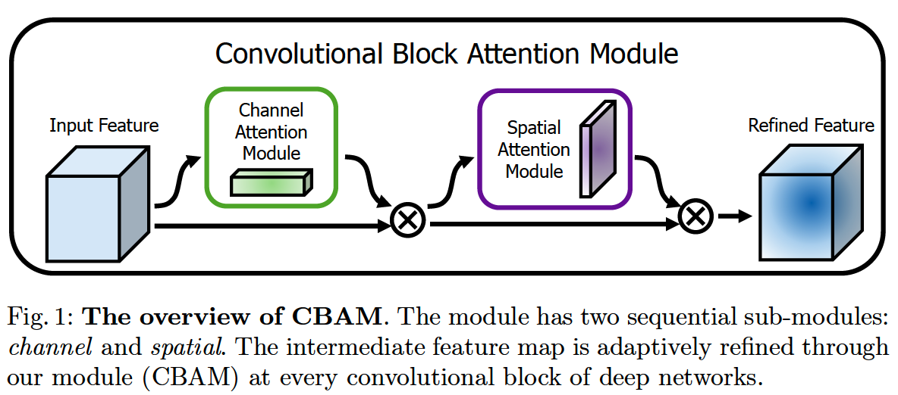
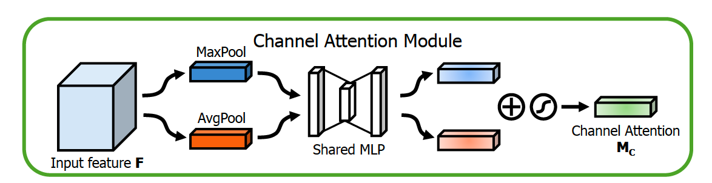
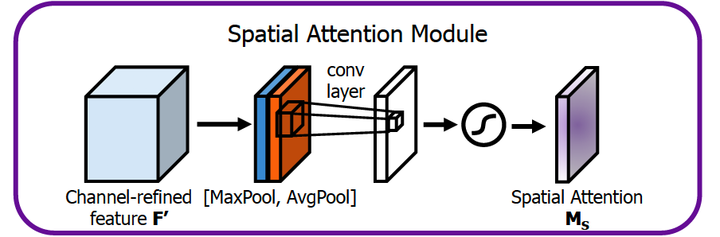

# 计算机视觉中的Attention机制
## 1.综述：
attention机制根本上讲目的就是为了得到相应的权重分布，然后将该分布与已知的特征按照一定的方式进行结合，就可以称之为attention。
## 2.常见的attention模块以及pytorch实现
### 2-1.CBAM模块

CBAM 中attention模块分为**Channel Attention Module**(通道注意力机制) 和**Spatial Attention Module**(空间注意力机制)：

通过**channel + spatial** 获得 权重分布，将其与feature map 融合得到 refined feature。 



### Channel Attention Module:

#### Channel Attention Module 模块：

在features map(C * **W** * **H**)进行MaxPool 以及 AvgPool操作（W*H维度上）获取空间的权重分布。



#### Pytorch 实现：

```python
class ChannelAttentionModule(nn.Module):
    def __init__(self,in_channels,ratio):
        super(ChannelAttentionModule,self).__init__()
        self.maxpool = nn.AdaptiveMaxPool2d(1)
        self.avgpool = nn.AdaptiveMaxPool2d(1)
        
        self.sharedMlP = nn.Sequential(
                         nn.Conv2d(in_channels,in_channels//ratio,stride=1,bias=False),
                         nn.ReLU(),
                         nn.Conv2d(in_channels//ratio,in_channels,1,bias=False))
        self.sigmoid = nn.Sigmoid()
    def forward(self,x):
        maxpool_output = self.sharedMlP(self.maxpool(x))
        avgpool_output = self.sharedMlP(self.avgpool(x))
        output = self.sigmoid(maxpool_output + avgpool_output)
        
        return output
```

### Spatital Attention Module

#### Spatital Attention Module 模块：

对Features map(**C** * W *H) 在**C** 维度上进行 mean 以及 max操作，得到两个 tensor，然后对其进行concat + conv + **sigmoid** ，得到output。



#### Pytorch 实现：

```python
class SpatialAttentionModule(nn.Module):
    def __init__(self,kernel_size=7):
        super(SpatialAttentionModule,self).__init__()
        assert kernel_size in (3,7),"kernel size must be 3 or 7"
        padding = 3 if kernel_size == 7 else 1
        
        self.conv = nn.Conv2d(2,1,kernel_size,padding=padding,bias=False)
        self.sigmoid = nn.Sigmoid()
    def forward(self,x):
        max_output,_ = torch.max(x,dim=1)
        avg_output = torch.mean(x,dim=1)
        x = torch.cat([max_output,avg_output],dim=1)
        x = self.conv(x)
        output = self.sigmoid(x)
        
        return output
```

### 2-2.SE模块

#### SE Attention 模块:

SE Attention：说白了se 模块就是为了得到 features map(**C** * W * H)中各feature map中权重信息，得到权重信息后与各feature map 进行融合。其中权重信息通过两个**FC** and **sigmoid** 获得。（和ChannelAttention没有什么不同）。


#### Pytorch实现：

```python
class SEAttentionModule(nn.Module):
    def __init__(self,in_channels,reduction=16):
        super(SEAttentionModule,self).__init__()
        self.avgpool = nn.AdaptiveAvgPool2d(1)
        self.fc = nn.Sequential(
                  nn.Linear(in_channels,in_channels//reduction,bias=False),
                  nn.ReLU(inplace=True),
                  nn.Linear(in_channels//reduction,in_channels,bias=False))
        self.sigmoid = nn.Sigmoid()
    def forward(self,x):
        batch_size,channel,_ = x.view()
        y = self.avgpool(x)
        y = x.view(x.size(0),-1)
        y = self.fc(x)
        y = self.sigmoid(x)
        y = y.view(batch_size,channel,1,1)
        output = x * y
        return output
```

### 2-3.BAM模块


#### Pyorch实现：

```python
#ChannelGate
class ChannelGate(nn.Module):
    def __init__(in_channels,r):
        super(ChannelGate,self).__init__()
        self.avgpool = nn.AdaptiveAvgPool2d(1)
        self.fc = nn.Sequential(
            nn.Linear(in_channels,in_channels//r),
            nn.BatchNorm2d(in_channels//r),
            nn.ReLU(inplace=True),
            nn.Linear(in_channels//r,in_channels),
            nn.BatchNorm2d(in_channels),
            nn.ReLU(inplace=True))
    def forward(self,x):
        output = self.avgpool(output)
        output = output.view(output.size(0),-1)
        output = self.fc(output)
        
        return output.expand_as(x) 
#SpatialGate      
class SpatialGate(nn.Module):
    def __init__(self,in_channels,ratio):
        super(SpatialGate,self).__init__()
        self.conv1x1 = nn.Sequential(
            nn.Conv2d(in_channels,in_channels//ratio,kernel_size=1,padding=0),
            nn.BatchNorm2d(in_channels//ratio),
            nn.ReLU(inplace=True))
        self.dilation_conv = nn.Sequential(
            nn.Conv2d(in_channels//ratio,in_channels//ratio,
                      kernel_size=3,padding=4,dilation=4),#dilation conv
            nn.BatchNorm2d(in_channels//ratio),
            nn.ReLU(),
            nn.Conv2d(in_channels//ratio,in_channels//ratio,
                      kernel_size=3,padding=4,dilation=4),#dilation conv
            nn.BatchNorm2d(in_channels//ratio),
            nn.ReLU())
        self.conv1x1_final = nn.Sequential(
            nn.Conv2d(in_channels//ratio,1,kernel_size=1,padding=0))
        def forward(self,x):
            output = self.conv1x1(output)
            output = self.dilation_conv(output)
            output = conv1x1_final(output)
            
            return output.expand_as(output)  
class BAM(nn.Module):
    def __init__(self, in_channels):
        super(BAM, self).__init__()
        self.channel_attention = ChannelGate(in_channels)
        self.spatial_attention = SpatialGate(in_channels)
    def forward(self,x):
        bam_attention = 1 + nn.Sigmoid(self.channel_attention(in_tensor) 
                                       + self.spatial_attention(in_tensor) )
        return bam_attention * x
```


### 2-4.SK模块

#### SK 模块：


**split**：group convolution

**Fuse**：类似SE Attention

**Select**：Select模块把SE Attention 模块的结果通过softmax得到不同channel之间的权重信息，然后乘以group convolution 的结果，最后将两个分支相加。

#### Pytorch 实现：

```python
class SKAttentionModule(nn.Module):
    def __init__(self,in_channels,G,L=32):
        super(SKAttentionModule,self).__init__()
        d = max(int(in_channels/r),L)
        self.conv3x3 = nn.Sequential(
             nn.Conv2d(in_channels, in_channels, kernel_size=3, padding=1, groups=G),
             nn.BatchNorm2d(in_channels),
             nn.ReLU(inplace=True)
            )
        self.conv5x5 = nn.Sequential(
             nn.Conv2d(in_channels, in_channels, kernel_size=5, padding=2, groups=G),
             nn.BatchNorm2d(in_channels),
             nn.ReLU(inplace=True)
            )
        self.gp = nn.AvgPool2d(WH)
        self.fc = nn.Linear(in_channels, d)
        self.fcs_1 = nn.Linear(d,in_channels)
        self.fcs_2 = nn.Linear(d,in_channels)
        
    def forward(self,x):
        branch1 = self.conv3x3(x)
        branch2 = self.conv5x5(x)
        branch_1_2 = torch.cat([branch1,branch2],dim=1)
        
        branch3 = branch1 + branch2
        f_gp = self.gp(branch3)
        f_fc = self.fc(f_gp)
        f_fcs1 = self.fcs_1(f_fc)
        f_fcs2 = self.fcs_2(f_fc)
        attention_vectors = torch.cat([f_fcs1,f_fcs2],dim=1).softmax(dim=1)
        attention_vectors = attention_vectors.view(attention_vectors.size(0),-1)
        
        output = attention_vectors * branch_1_2
        
        return output  
```


## 3.关于attention的paper：

[Attention Is All You Need](https://arxiv.org/abs/1706.03762)  

[Spatial Transformer Networks](https://arxiv.org/abs/1506.02025) 

[CBAM: Convolutional Block Attention Module](https://arxiv.org/abs/1807.06521) 

[Squeeze-and-Excitation Networks](https://arxiv.org/abs/1709.01507)

[BAM](https://arxiv.org/pdf/1807.06514.pdf)

[Selective Kernel Networks](http://openaccess.thecvf.com/content_CVPR_2019/papers/Li_Selective_Kernel_Networks_CVPR_2019_paper.pdf)


